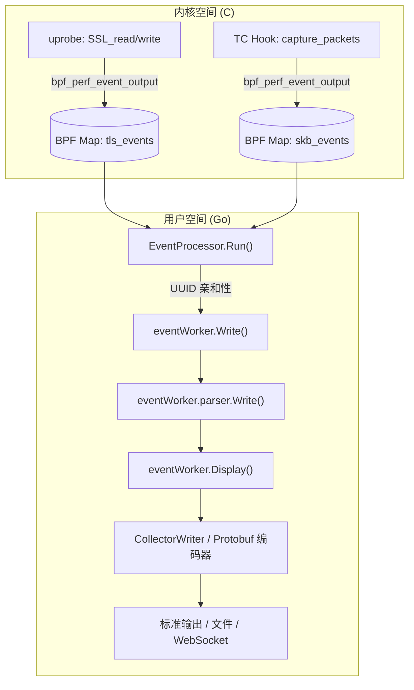
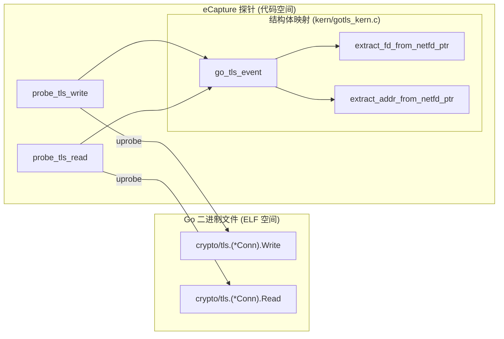

# 术语表

相关源文件

以下文件被用作生成此维基页面的上下文：

- [CHANGELOG.md](https://github.com/gojue/ecapture/blob/943a19fe/CHANGELOG.md)
- [README.md](https://github.com/gojue/ecapture/blob/943a19fe/README.md)
- [builder/Dockerfile](https://github.com/gojue/ecapture/blob/943a19fe/builder/Dockerfile)
- [builder/init_env.sh](https://github.com/gojue/ecapture/blob/943a19fe/builder/init_env.sh)
- [cli/cmd/root.go](https://github.com/gojue/ecapture/blob/943a19fe/cli/cmd/root.go)
- [examples/ecaptureq_client/README.md](https://github.com/gojue/ecapture/blob/943a19fe/examples/ecaptureq_client/README.md)
- [examples/ecaptureq_client/TESTING.md](https://github.com/gojue/ecapture/blob/943a19fe/examples/ecaptureq_client/TESTING.md)
- [examples/ecaptureq_client/go.mod](https://github.com/gojue/ecapture/blob/943a19fe/examples/ecaptureq_client/go.mod)
- [examples/ecaptureq_client/go.sum](https://github.com/gojue/ecapture/blob/943a19fe/examples/ecaptureq_client/go.sum)
- [functions.mk](https://github.com/gojue/ecapture/blob/943a19fe/functions.mk)
- [internal/probe/gotls/config.go](https://github.com/gojue/ecapture/blob/943a19fe/internal/probe/gotls/config.go)
- [internal/probe/gotls/event.go](https://github.com/gojue/ecapture/blob/943a19fe/internal/probe/gotls/event.go)
- [internal/probe/gotls/event_test.go](https://github.com/gojue/ecapture/blob/943a19fe/internal/probe/gotls/event_test.go)
- [kern/boringssl_masterkey.h](https://github.com/gojue/ecapture/blob/943a19fe/kern/boringssl_masterkey.h)
- [kern/common.h](https://github.com/gojue/ecapture/blob/943a19fe/kern/common.h)
- [kern/ecapture.h](https://github.com/gojue/ecapture/blob/943a19fe/kern/ecapture.h)
- [kern/gotls_kern.c](https://github.com/gojue/ecapture/blob/943a19fe/kern/gotls_kern.c)
- [kern/openssl.h](https://github.com/gojue/ecapture/blob/943a19fe/kern/openssl.h)
- [kern/openssl_masterkey.h](https://github.com/gojue/ecapture/blob/943a19fe/kern/openssl_masterkey.h)
- [kern/openssl_masterkey_3.0.h](https://github.com/gojue/ecapture/blob/943a19fe/kern/openssl_masterkey_3.0.h)
- [kern/tc.h](https://github.com/gojue/ecapture/blob/943a19fe/kern/tc.h)
- [main.go](https://github.com/gojue/ecapture/blob/943a19fe/main.go)
- [pkg/ecaptureq/README.md](https://github.com/gojue/ecapture/blob/943a19fe/pkg/ecaptureq/README.md)
- [pkg/event_processor/http_request.go](https://github.com/gojue/ecapture/blob/943a19fe/pkg/event_processor/http_request.go)
- [pkg/event_processor/http_response.go](https://github.com/gojue/ecapture/blob/943a19fe/pkg/event_processor/http_response.go)
- [pkg/event_processor/iparser.go](https://github.com/gojue/ecapture/blob/943a19fe/pkg/event_processor/iparser.go)
- [pkg/event_processor/iworker.go](https://github.com/gojue/ecapture/blob/943a19fe/pkg/event_processor/iworker.go)
- [pkg/event_processor/processor.go](https://github.com/gojue/ecapture/blob/943a19fe/pkg/event_processor/processor.go)
- [protobuf/gen/v1/ecaptureq.pb.go](https://github.com/gojue/ecapture/blob/943a19fe/protobuf/gen/v1/ecaptureq.pb.go)
- [protobuf/proto/v1/ecaptureq.proto](protobuf/proto/v1/ecaptureq.proto)
- [variables.mk](https://github.com/gojue/ecapture/blob/943a19fe/variables.mk)

本页面提供了 eCapture 项目中使用的代码库特定术语、eBPF 领域概念和技术行话的定义。它为新加入的工程师提供参考，帮助其理解系统的实现细节和数据流。

## eBPF 与内核概念

### BTF (BPF Type Format)
一种描述 BPF 程序和 Linux 内核数据类型的元数据格式。eCapture 使用 BTF 来支持 **CO-RE**（一次编译，到处运行），允许单个二进制文件在不同的内核版本上运行而无需重新编译。
*   **代码指针：** [cli/cmd/root.go:163-163](https://github.com/gojue/ecapture/blob/943a19fe/cli/cmd/root.go#L163-L163) 中的 `globalConf.BtfMode`。
*   **实现：** eCapture 会检查 BTF 的可用性，以决定加载 CO-RE 还是 non-CO-RE 字节码。

### CO-RE vs. Non-CO-RE
*   **CO-RE：** 使用 `vmlinux.h` 和 BPF 重定位。通过 [kern/ecapture.h:18-26](https://github.com/gojue/ecapture/blob/943a19fe/kern/ecapture.h#L18-L26) 中的 `#ifndef NOCORE` 块启用。
*   **Non-CO-RE：** 针对不支持 BTF 的内核的传统模式。它使用标准的 Linux 头文件，并且需要针对特定内核版本的特定字节码。定义在 [kern/ecapture.h:28-88](https://github.com/gojue/ecapture/blob/943a19fe/kern/ecapture.h#L28-L88) 中。

### Uprobe / Uretprobe
用户态探针。eCapture 将这些探针挂载到共享库中的函数（如 OpenSSL 中的 `SSL_read`），以拦截明文数据。
*   **代码指针：** [kern/openssl_masterkey.h:163-164](https://github.com/gojue/ecapture/blob/943a19fe/kern/openssl_masterkey.h#L163-L164)（用于提取 Master Key 的 uprobe）。

### TC (Traffic Control) Classifier
挂载到网络接口出口/入口（egress/ingress）钩子上的 eBPF 程序。在 eCapture 的 `pcap` 模式中用于捕获原始数据包。
*   **代码指针：** [kern/tc.h:136-199](https://github.com/gojue/ecapture/blob/943a19fe/kern/tc.h#L136-L199) 中的 `capture_packets` 函数。

---

## eCapture 子系统

### EventProcessor
用户态的中心枢纽，负责从 eBPF map 接收原始字节并将其分发给特定的 worker。
*   **代码指针：** [pkg/event_processor/processor.go](https://github.com/gojue/ecapture/blob/943a19fe/pkg/event_processor/processor.go) 中的 `EventProcessor` 结构体。

### EventWorker
针对每个连接或每个线程的 worker，负责处理捕获数据的有状态重组和解析。它维护一个缓冲区（`payload`）和一个 `IParser`。
*   **代码指针：** [pkg/event_processor/iworker.go:69-88](https://github.com/gojue/ecapture/blob/943a19fe/pkg/event_processor/iworker.go#L69-L88) 中的 `eventWorker` 结构体。
*   **函数：** `Display()` [pkg/event_processor/iworker.go:174-227](https://github.com/gojue/ecapture/blob/943a19fe/pkg/event_processor/iworker.go#L174-L227) 和 `Run()` [pkg/event_processor/iworker.go:261-265](https://github.com/gojue/ecapture/blob/943a19fe/pkg/event_processor/iworker.go#L261-L265)。

### IParser
特定协议解析器（如 HTTP/1.1、HTTP/2）的接口。它将原始字节流转换为结构化日志。
*   **代码指针：** [pkg/event_processor/iparser.go](https://github.com/gojue/ecapture/blob/943a19fe/pkg/event_processor/iparser.go) 中的 `IParser` 接口。

### eCaptureQ
一个基于 WebSocket 的远程事件分发系统。它允许 eCapture 作为服务器运行，使用 Protobuf 将捕获的事件推送到远程客户端。
*   **代码指针：** `pkg/ecaptureq/` 以及 [cli/cmd/root.go:170-170](https://github.com/gojue/ecapture/blob/943a19fe/cli/cmd/root.go#L170-L170) 中的 `globalConf.EcaptureQ`。

---

## TLS 与加密术语

### Master Secret / Keylog
用于派生 TLS 会话加密密钥的机密材料。eCapture 提取这些内容以允许 Wireshark 解密流量。
*   **代码指针：** [kern/boringssl_masterkey.h:33-52](https://github.com/gojue/ecapture/blob/943a19fe/kern/boringssl_masterkey.h#L33-L52) 中的 `mastersecret_bssl_t` 和 [kern/gotls_kern.c:50-57](https://github.com/gojue/ecapture/blob/943a19fe/kern/gotls_kern.c#L50-L57) 中的 `mastersecret_gotls_t`。

### SSL/TLS Plaintext Fragment (明文分片)
从 `SSL_read` 和 `SSL_write` 等库函数捕获的已解密数据。eCapture 将其限制为 `MAX_DATA_SIZE_OPENSSL` (16KB)，以适应 eBPF map 的限制。
*   **代码指针：** [kern/common.h:39-39](https://github.com/gojue/ecapture/blob/943a19fe/kern/common.h#L39-L39)。

---

## 代码实体映射图

### 数据路径：从内核钩子到用户输出
此图连接了基于 C 的内核探针与基于 Go 的处理流水线之间的鸿沟。

**Sources:** [pkg/event_processor/iworker.go:153-161](https://github.com/gojue/ecapture/blob/943a19fe/pkg/event_processor/iworker.go#L153-L161), [pkg/event_processor/iworker.go:174-227](https://github.com/gojue/ecapture/blob/943a19fe/pkg/event_processor/iworker.go#L174-L227), [kern/openssl.h:187-189](https://github.com/gojue/ecapture/blob/943a19fe/kern/openssl.h#L187-L189), [kern/tc.h:58-63](https://github.com/gojue/ecapture/blob/943a19fe/kern/tc.h#L58-L63)。

### GoTLS 实现：符号到结构体映射
GoTLS 捕获依赖于 Go 运行时和 TLS 库中的特定偏移量。

**Sources:** [kern/gotls_kern.c:31-48](https://github.com/gojue/ecapture/blob/943a19fe/kern/gotls_kern.c#L31-L48), [kern/gotls_kern.c:132-144](https://github.com/gojue/ecapture/blob/943a19fe/kern/gotls_kern.c#L132-L144), [kern/gotls_kern.c:162-165](https://github.com/gojue/ecapture/blob/943a19fe/kern/gotls_kern.c#L162-L165)。

---

## 构建系统词汇

| 术语 | 定义 | 代码参考 |
| :--- | :--- | :--- |
| `BYTECODE_FILES` | Makefile 变量，定义了哪些 eBPF 程序需要编译。 | [variables.mk:36-36](https://github.com/gojue/ecapture/blob/943a19fe/variables.mk#L36-L36) |
| `go-bindata` | 用于将 eBPF `.o` 或 `.nocore` 文件嵌入到 Go 二进制文件中的工具。 | [main.go:4-4](https://github.com/gojue/ecapture/blob/943a19fe/main.go#L4-L4) |
| `EXTRA_CFLAGS` | eBPF 程序的编译器标志，包括优化级别 (`-O2`)。 | [variables.mk:236-240](https://github.com/gojue/ecapture/blob/943a19fe/variables.mk#L236-L240) |
| `TARGET_TAG` | 用于区分 `linux` 和 `ecap_android` 的构建标签。 | [variables.mk:65-68](https://github.com/gojue/ecapture/blob/943a19fe/variables.mk#L65-L68) |

**Sources:** [variables.mk:36-36](https://github.com/gojue/ecapture/blob/943a19fe/variables.mk#L36-L36), [variables.mk:65-68](https://github.com/gojue/ecapture/blob/943a19fe/variables.mk#L65-L68), [variables.mk:236-240](https://github.com/gojue/ecapture/blob/943a19fe/variables.mk#L236-L240), [main.go:4-4](https://github.com/gojue/ecapture/blob/943a19fe/main.go#L4-L4)。