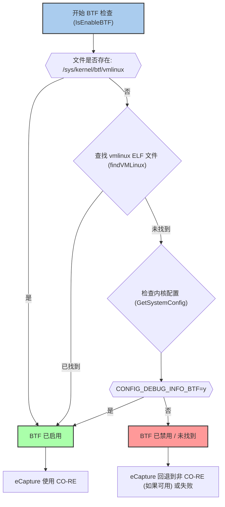
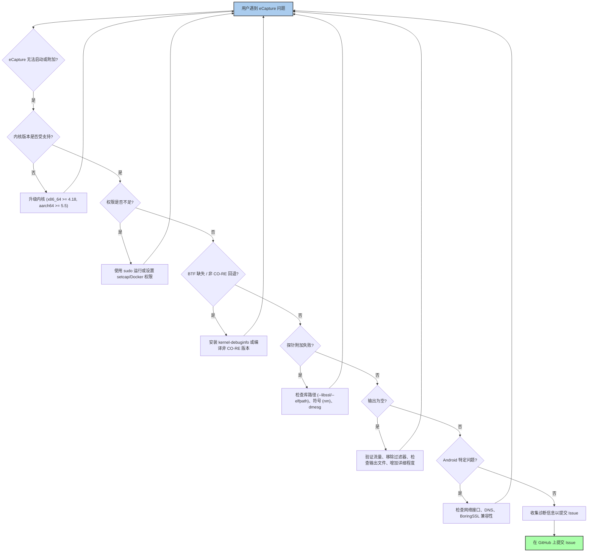

# 故障排查

<details>
<summary>相关源文件</summary>

以下文件被用作生成此维基页面的上下文：

- [.github/ISSUE_TEMPLATE/bug_report.md](https://github.com/gojue/ecapture/blob/943a19fe/.github/ISSUE_TEMPLATE/bug_report.md)
- [.golangci.yml](https://github.com/gojue/ecapture/blob/943a19fe/.golangci.yml)
- [CHANGELOG.md](https://github.com/gojue/ecapture/blob/943a19fe/CHANGELOG.md)
- [README.md](https://github.com/gojue/ecapture/blob/943a19fe/README.md)
- [cli/cmd/env_detection.go](https://github.com/gojue/ecapture/blob/943a19fe/cli/cmd/env_detection.go)
- [main.go](https://github.com/gojue/ecapture/blob/943a19fe/main.go)
- [pkg/util/ebpf/bpf.go](https://github.com/gojue/ecapture/blob/943a19fe/pkg/util/ebpf/bpf.go)
- [pkg/util/ebpf/bpf_linux.go](https://github.com/gojue/ecapture/blob/943a19fe/pkg/util/ebpf/bpf_linux.go)
- [pkg/util/ebpf/bpf_test.go](https://github.com/gojue/ecapture/blob/943a19fe/pkg/util/ebpf/bpf_test.go)
- [pkg/util/kernel/kernel_version.go](https://github.com/gojue/ecapture/blob/943a19fe/pkg/util/kernel/kernel_version.go)
- [pkg/util/kernel/kernel_version_unsupport.go](https://github.com/gojue/ecapture/blob/943a19fe/pkg/util/kernel/kernel_version_unsupport.go)
- [pkg/util/kernel/version.go](https://github.com/gojue/ecapture/blob/943a19fe/pkg/util/kernel/version.go)

</details>

本页提供了一份在 eCapture 安装、运行和集成过程中遇到的常见问题的汇总列表。它涵盖了诸如 BTF 信息缺失、权限不足、内核版本不支持、探针附加失败、输出为空以及 Android 特定挑战等问题。同时，它还概述了如何收集诊断信息以便有效地提交 Issue。

## 1. BTF 缺失（非 CO-RE 模式回退）

eCapture 主要利用 CO-RE（一次编译，到处运行）技术来实现其 eBPF 程序，这依赖于宿主内核提供的 BTF（BPF 类型格式）信息。如果找不到 BTF，eCapture 会尝试回退到非 CO-RE 模式，这需要内核头文件包或针对你内核特定编译的 eBPF 程序。

**问题：** 你可能会看到与缺少 BTF 或 `vmlinux` 文件相关的错误，或者关于回退到非 CO-RE 模式的警告。

**eCapture 如何检测 BTF：**
eCapture 通过两种主要方式检查 BTF 可用性：
1.  **`/sys/kernel/btf/vmlinux`**：首先检查 `/sys/kernel/btf/vmlinux` 路径下是否存在 BTF 文件 [pkg/util/ebpf/bpf.go:89-94](https://github.com/gojue/ecapture/blob/943a19fe/pkg/util/ebpf/bpf.go#L89-L94)。
2.  **`vmlinux` ELF 文件**：如果找不到 `/sys/kernel/btf/vmlinux` 文件，它会扫描一系列常见位置，查找包含 BTF 信息的 `vmlinux` ELF 文件 [pkg/util/ebpf/bpf.go:100-116](https://github.com/gojue/ecapture/blob/943a19fe/pkg/util/ebpf/bpf.go#L100-L116)。这些位置包括：
    *   `/boot/vmlinux-%s`
    *   `/lib/modules/%s/vmlinux-%[1]s`
    *   `/lib/modules/%s/build/vmlinux`
    *   `/usr/lib/modules/%s/kernel/vmlinux`
    *   `/usr/lib/debug/boot/vmlinux-%s`
    *   `/usr/lib/debug/boot/vmlinux-%s.debug`
    *   `/usr/lib/debug/lib/modules/%s/vmlinux`
    [pkg/util/ebpf/bpf_linux.go:37-45](https://github.com/gojue/ecapture/blob/943a19fe/pkg/util/ebpf/bpf_linux.go#L37-L45)
3.  **内核配置**：最后，它会检查内核配置中的 `CONFIG_DEBUG_INFO_BTF=y` [pkg/util/ebpf/bpf.go:131-142](https://github.com/gojue/ecapture/blob/943a19fe/pkg/util/ebpf/bpf.go#L131-L142)。此配置表明内核编译时开启了 BTF 支持。搜索内核配置文件的路径包括 `/proc/config.gz`、`/boot/config`、`/boot/config-%s` 和 `/lib/modules/%s/build/.config` [pkg/util/ebpf/bpf.go:38-43](https://github.com/gojue/ecapture/blob/943a19fe/pkg/util/ebpf/bpf.go#L38-L43)。

**故障排查步骤：**

1.  **检查 `/sys/kernel/btf/vmlinux`**：
    ```bash
    ls /sys/kernel/btf/vmlinux
    ```
    如果该文件存在，说明你的内核支持 BTF。
2.  **安装 `kernel-debuginfo` 或 `kernel-devel`**：在许多发行版上，安装内核的调试信息包将提供包含 BTF 的必要 `vmlinux` 文件。
    *   **Debian/Ubuntu**：`sudo apt install linux-image-$(uname -r)-dbg`
    *   **CentOS/RHEL/Fedora**：`sudo dnf debuginfo-install kernel-$(uname -r)` 或 `sudo yum install kernel-devel`
3.  **从源码编译（非 CO-RE）**：如果你无法启用 BTF 或找不到调试符号，你可能需要以非 CO-RE 模式从源码编译 eCapture，这要求编译时存在内核头文件。详情请参考 [源码编译指南](../8-developer-guide/8.1-compilation-and-build.md) 页面。

**图表：BTF 检测流程**

Sources: [pkg/util/ebpf/bpf.go:89-143](https://github.com/gojue/ecapture/blob/943a19fe/pkg/util/ebpf/bpf.go#L89-L143), [pkg/util/ebpf/bpf_linux.go:37-45](https://github.com/gojue/ecapture/blob/943a19fe/pkg/util/ebpf/bpf_linux.go#L37-L45)

## 2. 权限不足（Capability 错误）

eCapture 需要提升权限来加载 eBPF 程序并附加探针。在没有必要 Linux Capabilities 的情况下运行会导致权限拒绝错误。

**问题：** 你会看到类似 `permission denied`、`operation not permitted` 或 `failed to load bpf programs` 的错误。

**错误消息示例：**
`the current user does not have CAP_BPF to load bpf programs. Please run as root or use sudo or add the --privileged=true flag for Docker` [cli/cmd/env_detection.go:58-59](https://github.com/gojue/ecapture/blob/943a19fe/cli/cmd/env_detection.go#L58-L59)

**所需权限：**
具体权限取决于你的内核版本：

*   **内核 < 5.8**：需要 `CAP_SYS_ADMIN`。这是一个权限很大的 Capability，应谨慎使用。
*   **内核 >= 5.8**：可以使用更细粒度的 `CAP_BPF`、`CAP_PERFMON` 和 `CAP_SYS_PTRACE` 组合。
*   **Pcapng 模式**：另外需要 `CAP_NET_ADMIN` 来创建用于数据包捕获的网络接口。

eCapture 在启动时会执行 `CAP_BPF` 或 `CAP_SYS_ADMIN` 检查 [cli/cmd/env_detection.go:47-60](https://github.com/gojue/ecapture/blob/943a19fe/cli/cmd/env_detection.go#L47-L60)。

**故障排查步骤：**

1.  **使用 `sudo` 运行**：最简单的解决方案是使用 `sudo` 运行 eCapture。
    ```bash
    sudo ecapture tls
    ```
2.  **授予特定权限（推荐用于生产环境）**：使用 `setcap` 为二进制文件授予所需权限。
    ```bash
    # 适用于内核 >= 5.8 (推荐)
    sudo setcap 'cap_bpf,cap_perfmon,cap_sys_ptrace+ep' /path/to/ecapture
    # 如果使用 pcapng 模式，还需添加 CAP_NET_ADMIN
    sudo setcap 'cap_bpf,cap_perfmon,cap_sys_ptrace,cap_net_admin+ep' /path/to/ecapture

    # 适用于内核 < 5.8 (安全性较低)
    sudo setcap 'cap_sys_admin+ep' /path/to/ecapture
    ```
    设置权限后，你可以以非 root 用户身份运行 eCapture。
3.  **Docker 容器**：在 Docker 中运行 eCapture 时，使用 `--privileged=true`（安全性较低）或指定单个 Capability。
    ```bash
    # 安全性较低，授予所有权限
    docker run --rm --privileged=true --net=host gojue/ecapture tls

    # 安全性较高，指定权限
    docker run --rm --cap-add=BPF --cap-add=PERFMON --cap-add=SYS_PTRACE --net=host gojue/ecapture tls
    # pcapng 模式需添加 --cap-add=NET_ADMIN
    ```
    参考 [最小权限配置](../2-getting-started/2.2-minimum-privileges.md) 页面获取详细示例。

Sources: [cli/cmd/env_detection.go:47-60](https://github.com/gojue/ecapture/blob/943a19fe/cli/cmd/env_detection.go#L47-L60), [README.md:70](https://github.com/gojue/ecapture/blob/943a19fe/README.md#L70)

## 3. 不支持的内核

由于所使用的 eBPF 特性，eCapture 对内核版本有最低要求。

**问题：** eCapture 退出并报错，提示内核版本不支持。

**错误消息示例：**
`the Linux/Android Kernel version 4.15.0 (x86_64) is not supported. Requires a version greater than 4.18` [cli/cmd/env_detection.go:35-36](https://github.com/gojue/ecapture/blob/943a19fe/cli/cmd/env_detection.go#L35-L36)

**最低内核版本：**

*   **x86_64**：Linux 内核版本 4.18 或更高 [cli/cmd/env_detection.go:33-36](https://github.com/gojue/ecapture/blob/943a19fe/cli/cmd/env_detection.go#L33-L36)
*   **aarch64**：Linux 内核版本 5.5 或更高 [cli/cmd/env_detection.go:37-40](https://github.com/gojue/ecapture/blob/943a19fe/cli/cmd/env_detection.go#L37-L40)

**故障排查步骤：**

1.  **检查你的内核版本**：
    ```bash
    uname -r
    ```
2.  **升级内核**：如果你的内核低于最低要求，则需要升级。此过程因发行版而异。
    *   **Ubuntu/Debian**：`sudo apt update && sudo apt upgrade`（可能不会升级到新的大版本内核）或安装特定版本的内核。
    *   **CentOS/RHEL/Fedora**：`sudo dnf update kernel` 或 `sudo yum update kernel`。
3.  **考虑更换环境**：如果升级内核不可行，请考虑在具有受支持内核版本的虚拟机或容器中运行 eCapture。

Sources: [cli/cmd/env_detection.go:27-43](https://github.com/gojue/ecapture/blob/943a19fe/cli/cmd/env_detection.go#L27-L43), [README.md:13](https://github.com/gojue/ecapture/blob/943a19fe/README.md#L13)

## 4. 探针附加失败（符号缺失、库路径错误）

eCapture 使用 `uprobes` 附加到用户空间库中的特定函数（例如 OpenSSL 中的 `SSL_read`、`SSL_write`）。如果找不到目标库或函数，探针将无法附加。

**问题：** 你会看到类似 `failed to attach uprobe`、`symbol not found` 或 `library not found` 的错误。

**常见原因：**

*   **库路径不正确**：eCapture 会尝试自动检测库路径（例如 OpenSSL，它会搜索 `/etc/ld.so.conf` 和常见位置）[README.md:108](https://github.com/gojue/ecapture/blob/943a19fe/README.md#L108)。如果库安装在非标准位置，自动检测可能会失败。
*   **静态编译的二进制文件**：如果目标应用程序是静态编译的，eCapture 尝试挂载的函数可能不会作为动态符号暴露。对于 GoTLS，如果二进制文件被去除了符号（stripped），符号信息就会丢失。
*   **不支持的库版本**：虽然 eCapture 支持广泛的库版本，但极旧或极新且未经测试的版本可能具有不同的内部函数名称或结构。
*   **缺少调试符号**：有时，`uprobe` 附加所需的符号仅在调试符号包中提供。

**故障排查步骤：**

1.  **手动指定库路径**：使用 `--libssl`（用于 TLS 探针）或 `--elfpath`（用于 GoTLS 探针）参数显式指向目标库或二进制文件。
    ```bash
    # 对于 OpenSSL
    sudo ecapture tls --libssl /usr/lib/x86_64-linux-gnu/libssl.so.1.1

    # 对于 GoTLS (如果 Go 二进制文件被去除了符号，你可能需要未去除符号的版本或符号文件)
    sudo ecapture gotls --elfpath /path/to/your/go_application
    ```
    如果目标程序是静态编译的，你可以直接将程序路径设置为 `--libssl` 参数的值 [README.md:112](https://github.com/gojue/ecapture/blob/943a19fe/README.md#L112)。
2.  **检查调试符号**：如有必要，请确保已安装目标库的调试符号包。
    *   **Debian/Ubuntu**：`sudo apt install libssl-dev`（用于 OpenSSL 开发头文件和符号）
3.  **验证函数是否存在**：使用 `nm -D /path/to/library.so | grep SSL_read` 检查目标函数（`SSL_read`、`SSL_write`、`PR_Read`、`PR_Write`、`dispatch_command`、`exec_simple_query`、`readline`、`rl_line_buffer` 等）是否存在于库中。
4.  **检查 `dmesg` 中的 eBPF 错误**：如果探针附加在底层失败，内核日志（`dmesg`）可能包含更详细的 eBPF 相关错误。
5.  **查阅特定探针文档**：每个探针（TLS、GoTLS、GnuTLS、NSS、MySQL、PostgreSQL、Bash、Zsh）都有特定的要求和支持的版本。详情请参考 [探针参考手册](../3-probe-reference/index.md) 章节。

## 5. 输出为空

你运行了 eCapture 且启动成功，但即使流量明显在流动，也没有显示任何输出。

**问题：** eCapture 运行正常且无报错，但未产生捕获数据。

**常见原因：**

*   **没有匹配的流量**：目标应用程序可能没有使用被挂载的库，或者没有发生相关的流量。
*   **PID 过滤不正确**：如果你使用了 `--pid` 或 `--uid` 过滤器，请确保它们正确匹配了目标进程。注意，在内核 < 5.2 的版本上，`--pid`/`--uid` 过滤器会被静默忽略 [CHANGELOG.md:7](https://github.com/gojue/ecapture/blob/943a19fe/CHANGELOG.md#L7)。
*   **应用程序未使用挂载的函数**：例如，应用程序可能使用了 OpenSSL 以外的其他 TLS 库，或者使用了自定义的网络栈。
*   **eBPF 程序未触发**：eBPF 程序可能已加载，但它设计的挂载代码路径未被目标应用程序执行。
*   **输出模式配置**：如果你使用 `pcapng` 或 `keylog` 模式，输出可能会写入文件而不是标准输出（stdout）。
*   **容器环境问题**：在某些容器设置中，进程命名空间或网络配置可能会阻止 eCapture 看到目标进程或流量。

**故障排查步骤：**

1.  **验证目标应用活动**：确保你尝试监控的应用正在积极产生使用挂载库的流量。例如，如果使用 `tls` 探针，请确保发起了 HTTPS 请求。
2.  **移除过滤器**：临时移除任何 `--pid`、`--uid` 或其他过滤器，以确保它们没有意外地屏蔽输出。
3.  **检查输出文件**：如果使用 `pcapng` 或 `keylog` 模式，请验证指定的输出文件（`--pcapfile`、`--keylogfile`）是否存在且包含数据。
    ```bash
    # 检查 pcapng 文件
    ls -lh ecapture_openssl.pcapng
    # 检查 keylog 文件
    cat openssl_keylog.log
    ```
4.  **增加详细程度**：使用 `-v` 或 `--debug` 参数运行 eCapture 以获取更详细的日志，这可能会提示为什么没有事件被处理。
5.  **使用已知可行的示例进行测试**：尝试捕获一个简单的 `curl https://google.com` 命令的流量，以确认基础功能是否正常。
6.  **检查 `dmesg`**：在内核日志中查找任何 eBPF 相关的警告或错误，这可能解释了为什么事件没有生成或处理。
7.  **Cgroup 过滤**：如果在容器化环境中运行，请确保 cgroup 过滤已正确配置，特别是对于 `TC hook` 和 `GoTLS uprobe` [CHANGELOG.md:20](https://github.com/gojue/ecapture/blob/943a19fe/CHANGELOG.md#L20)。

## 6. Android 特定问题

eCapture 在内核 >= 5.5 的 aarch64 设备上支持 Android GKI（通用内核镜像）。Android 环境通常面临独特的挑战。

**问题：** Android 特有的问题，如网络接口检测、DNS 解析或 BoringSSL 版本兼容性。

**常见的 Android 特定问题：**

*   **网络接口自动检测**：Android 设备可能具有不同的网络接口命名约定或活跃接口。
*   **DNS 解析**：Android 模拟器或特定设备配置可能会遇到 DNS 解析问题，从而影响用于测试的 `curl` 或其他网络工具。
*   **BoringSSL 版本**：Android 使用 BoringSSL，特定版本（如 `a_13` ~ `a_16` 和 `na` 分支）需要 `tls` 探针进行特殊处理。
*   **`--pid`/`--uid` 过滤**：如前所述，在内核 < 5.2 的版本上这些过滤器会被忽略，这可能与较旧的 Android 内核有关。

**故障排查步骤：**

1.  **验证 Android GKI 和内核版本**：确保你的 Android 设备运行的是 GKI 内核，并满足最低版本要求（aarch64 >= 5.5）。
2.  **检查 PCAP 模式的活跃网络接口**：eCapture 会尝试自动检测 Android e2e PCAP 模式下的活跃网络接口 [CHANGELOG.md:31](https://github.com/gojue/ecapture/blob/943a19fe/CHANGELOG.md#L31)。如果检测失败，你可能需要使用 `-i` 参数手动指定接口。
    ```bash
    # 在 Android 上查找活跃接口 (例如 wlan0, eth0, rmnet_data0)
    ip a
    # 然后在 ecapture 中使用
    sudo ecapture tls -m pcap -i rmnet_data0
    ```
3.  **Android 模拟器的 DNS 解析**：如果你遇到 DNS 问题（特别是在模拟器中），eCapture 可能会通过使用自定义 DNS 服务器来改进 DNS 解析 [CHANGELOG.md:82](https://github.com/gojue/ecapture/blob/943a19fe/CHANGELOG.md#L82)。请确保模拟器的网络设置正确。
4.  **BoringSSL 兼容性**：`tls` 探针对 Android BoringSSL 版本有特定的逻辑。如果你怀疑存在兼容性问题，请检查 eCapture 源代码或提交包含你的 Android 版本和 BoringSSL 版本的 Issue。
5.  **使用 `ecap_android` 标签编译**：为 Android 编译时，请确保使用 `ecap_android` 编译标签（原为 `androidgki`）[CHANGELOG.md:99](https://github.com/gojue/ecapture/blob/943a19fe/CHANGELOG.md#L99)。
    ```bash
    make android
    ```

## 7. 如何为 Issue 报告收集诊断信息

在报告问题时，提供全面的诊断信息有助于维护者快速理解并解决问题。

**Bug 报告的基本信息：**

1.  **Bug 描述**：对出错情况的清晰简要说明。
2.  **复现步骤**：能够可靠触发 Bug 的编号步骤列表。
3.  **截图/日志**：如果适用，请包含错误的截图或相关的日志输出。
4.  **环境详情**：
    *   **设备/操作系统**：`Linux Server` 或 `Pixel 9`（或其他 Android 设备）[/.github/ISSUE_TEMPLATE/bug_report.md:29](https://github.com/gojue/ecapture/blob/943a19fe//.github/ISSUE_TEMPLATE/bug_report.md#L29)
    *   **内核信息**：`uname -a` 的输出 [/.github/ISSUE_TEMPLATE/bug_report.md:30](https://github.com/gojue/ecapture/blob/943a19fe//.github/ISSUE_TEMPLATE/bug_report.md#L30)
    *   **eCapture 版本**：`ecapture -v` 的输出 [/.github/ISSUE_TEMPLATE/bug_report.md:31](https://github.com/gojue/ecapture/blob/943a19fe//.github/ISSUE_TEMPLATE/bug_report.md#L31)
    *   **CPU 架构**：`x86_64` 或 `aarch64`
    *   **容器环境**：如果在 Docker 或 Kubernetes 中运行，请指定版本和相关配置（例如 `--privileged`、`securityContext`）。
5.  **使用的 eCapture 命令**：你执行的完整 `ecapture` 命令。
6.  **完整的 eCapture 输出**：复制并粘贴 eCapture 的完整输出，包括任何错误消息或警告。
7.  **`dmesg` 输出**：相关的内核日志消息，特别是包含 `bpf` 或 `uprobe` 的消息。
    ```bash
    sudo dmesg | grep -i "bpf\|uprobe"
    ```
8.  **目标应用详情**：
    *   被监控应用的名称和版本（例如 `nginx 1.20`、`curl 7.68`）。
    *   目标库或二进制文件的路径（例如 `/usr/lib/x86_64-linux-gnu/libssl.so.1.1`、`/path/to/go_app`）。
    *   如果适用，提供 `ldd /path/to/application` 或 `nm -D /path/to/library.so` 的输出。
9.  **内核配置**：如果 BTF 是问题所在，请提供相关的内核配置选项。
    ```bash
    # 尝试查找你的内核配置
    zcat /proc/config.gz | grep -E "CONFIG_BPF|CONFIG_UPROBES|CONFIG_ARCH_SUPPORTS_UPROBES|CONFIG_DEBUG_INFO_BTF"
    ```

**优秀 Issue 报告示例：**
参考 `.github/ISSUE_TEMPLATE/bug_report.md` 模板，了解结构化的 Bug 报告方法。

Sources: [/.github/ISSUE_TEMPLATE/bug_report.md:1-34](https://github.com/gojue/ecapture/blob/943a19fe//.github/ISSUE_TEMPLATE/bug_report.md#L1-L34)

## 图表：故障排查流程

Sources: [cli/cmd/env_detection.go:27-60](https://github.com/gojue/ecapture/blob/943a19fe/cli/cmd/env_detection.go#L27-L60), [pkg/util/ebpf/bpf.go:89-143](https://github.com/gojue/ecapture/blob/943a19fe/pkg/util/ebpf/bpf.go#L89-L143), [pkg/util/ebpf/bpf_linux.go:37-45](https://github.com/gojue/ecapture/blob/943a19fe/pkg/util/ebpf/bpf_linux.go#L37-L45), [README.md:108-112](https://github.com/gojue/ecapture/blob/943a19fe/README.md#L108-L112), [CHANGELOG.md:7](https://github.com/gojue/ecapture/blob/943a19fe/CHANGELOG.md#L7), [CHANGELOG.md:20](https://github.com/gojue/ecapture/blob/943a19fe/CHANGELOG.md#L20), [CHANGELOG.md:31](https://github.com/gojue/ecapture/blob/943a19fe/CHANGELOG.md#L31), [CHANGELOG.md:82](https://github.com/gojue/ecapture/blob/943a19fe/CHANGELOG.md#L82), [CHANGELOG.md:99](https://github.com/gojue/ecapture/blob/943a19fe/CHANGELOG.md#L99), [/.github/ISSUE_TEMPLATE/bug_report.md:1-34](https://github.com/gojue/ecapture/blob/943a19fe//.github/ISSUE_TEMPLATE/bug_report.md#L1-L34)